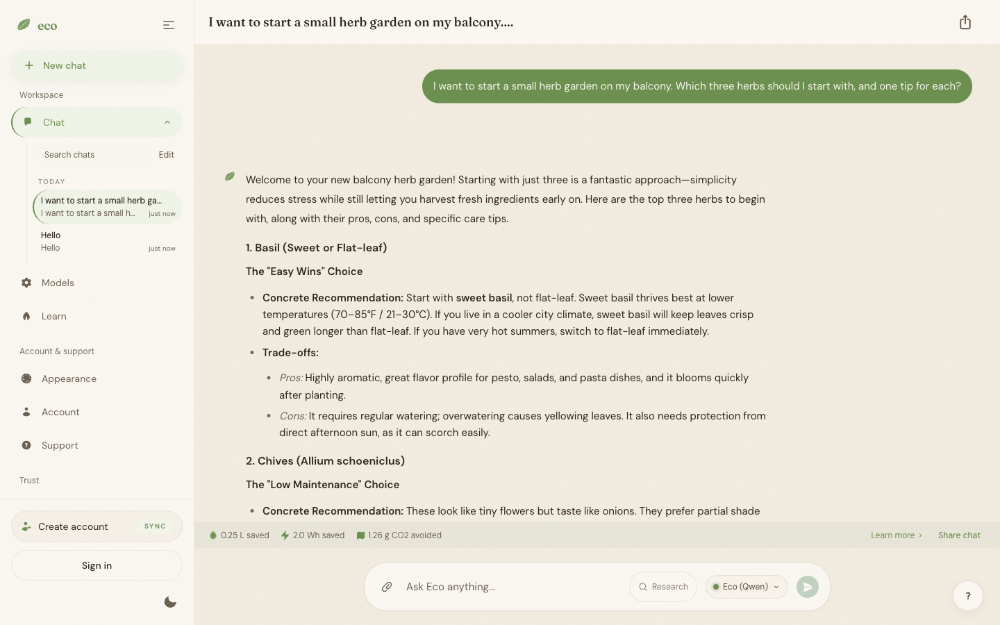

# Eco

**Local-first AI chat that runs on your own device.**

[](https://github.com/camsteinberg/eco/actions/workflows/ci.yml)
[](./LICENSE)

Eco is an AI chat app that keeps the conversation on your device. The model runs in
your browser, so the words you type never have to leave the machine you typed them on.
It's an alternative to ChatGPT, Claude, and Gemini for people who want a good product
without trading away their privacy to get it.

Privacy here is a property of the architecture, not a policy. Inference happens
on-device via WebGPU; there is no server in the loop for chat. Conversations can
persist locally in the browser (OPFS / IndexedDB) so you can pick up where you left
off, and they stay there. The only parts that touch a server are the ones that need
one — signing in and, if you choose to support the project, billing.

Eco is free and open source under AGPL-3.0. There's a Supporter tier for people who
want to help fund the work; free and Supporter have identical functionality — there
are no feature gates.

Live at [econetwork.ai](https://econetwork.ai).



## Quickstart — chat with zero services

The on-device chat runs entirely in your browser. To try it, you don't need a database,
a Redis instance, or any secrets.

```bash
pnpm install
pnpm dev
```

Then open **http://localhost:3000/chat**.

(`pnpm dev` also starts the API gateway on `:3001`; without a database it runs in a
degraded no-op mode, which is fine — chat never touches it. To run *only* the web app,
build the shared UI package once with `pnpm --filter @eco/ui build`, then
`pnpm --filter @eco/web dev`.)

The chat surface is usable as a guest, so nothing gates your way in during local
development, and the first model downloads and runs directly in the browser. Requirements:
Node 22, pnpm 9, and a WebGPU-capable browser (recent Chrome or Edge is the smoothest
path; the app falls back to a small CPU model where WebGPU isn't available).

> The first model download can take a few minutes depending on the model and your
> connection — the setup flow starts you on a small "starter" model and offers an
> opt-in upgrade once you're chatting.

## Full-stack development

You only need this if you're working on **auth or billing** — the server-side surfaces.
The API gateway (`apps/api`) provides authentication and Stripe billing; it needs
PostgreSQL and Redis.

1. Bring up Postgres (`127.0.0.1:5432`) and Redis (`127.0.0.1:6379`) however you prefer
   (Docker, Homebrew, a managed instance — anything reachable at those addresses).
2. Copy the example env files and fill in what you need:

   ```bash
   cp apps/api/.env.example apps/api/.env
   cp apps/web/.env.example apps/web/.env.local
   ```

   Both example files document every variable inline. Sensible defaults point the web
   app at the API on `http://localhost:3001`. Billing routes stay unmounted unless all
   three Stripe variables are set; email verification and password reset stay off unless
   `RESEND_API_KEY` is set. None of that is required to run auth locally.

3. Run everything together:

   ```bash
   pnpm dev            # web on :3000, api on :3001
   ```

If you need to sign in to a member-only surface without standing up a real auth session,
there's a loopback-only `POST /api/dev-login` route that sets a throwaway session cookie
for local UI testing. It only works over localhost and never creates a real account.

**Ports:** web `3000`, api `3001`. **Database:** Postgres `127.0.0.1:5432`, Redis
`127.0.0.1:6379`.

## Architecture

Eco is a pnpm + Turborepo monorepo.

```
apps/
  web/        Next.js 16 (App Router) web app — landing, on-device chat,
              settings, auth, billing, content pages. This is the product.
  api/        Hono API gateway — auth + sessions (Better Auth) and Stripe
              billing only. No chat traffic passes through it.
packages/
  ui/         Shared component library used by the web app.
  config/     Shared TypeScript + ESLint configuration.
```

The on-device AI lives in `apps/web/src/local-ai/`. Inference runs through two
in-browser runtimes depending on the model and device:

- **Transformers.js v4 + WebGPU** — the primary runtime for most models.
- **LiteRT-LM** — runs Gemma 4 E2B.

The shipping model catalog is defined in
`apps/web/src/local-ai/catalog/catalog-data.json`. A diagnostics surface is available at
`/diagnostics/local-ai?eco-diagnostics=1` for inspecting device capability, model
selection, and download behavior.

**Stack:** Next.js 16, React 19, Tailwind CSS 4, Zustand, Motion (web) · Hono, Better
Auth, Drizzle ORM, PostgreSQL, Redis (api) · Node 22, pnpm 9, TypeScript 5 strict.

## Testing & QA

```bash
pnpm type-check      # type-check the whole monorepo
pnpm lint            # lint
pnpm test            # all TypeScript unit tests (Vitest)
pnpm check:cycles    # guard against circular dependencies

pnpm --filter @eco/web exec playwright test   # end-to-end (Playwright)
```

Package-scoped test runs are faster when your change is contained:

```bash
pnpm --filter @eco/web test
pnpm --filter @eco/api test
pnpm --filter @eco/ui test
```

## License

Eco is licensed under **AGPL-3.0-or-later** — see [`LICENSE`](./LICENSE). In plain terms:
you're free to use, study, modify, and share it, but if you run a modified version as a
network service, you must offer that service's users the corresponding source. Every
source file carries an SPDX header.

## Contributing

Contributions are welcome — start with [`CONTRIBUTING.md`](./CONTRIBUTING.md) for the dev
setup, the QA bar, UI guidelines, and how to sign your commits. [`AGENTS.md`](./AGENTS.md)
is the codebase orientation for contributors and AI coding agents. Security reports go
through [`SECURITY.md`](./SECURITY.md).
